en la ruta de nuestro docker-compose.yml ejecutamos
```sh
sudo docker compose up -d
```
para crear las instancias de prestashop y la base de datos

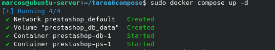

Luego desde el navegador ya podemos acceder a la configuracion del prestashop

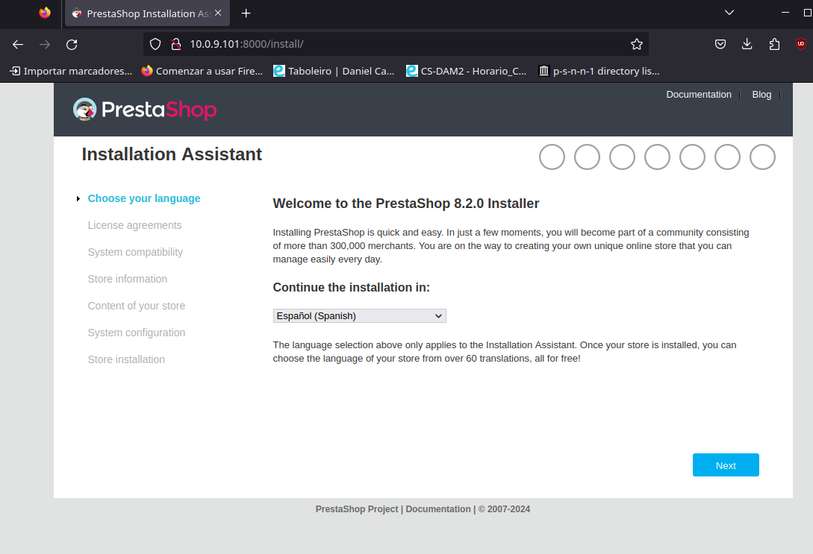

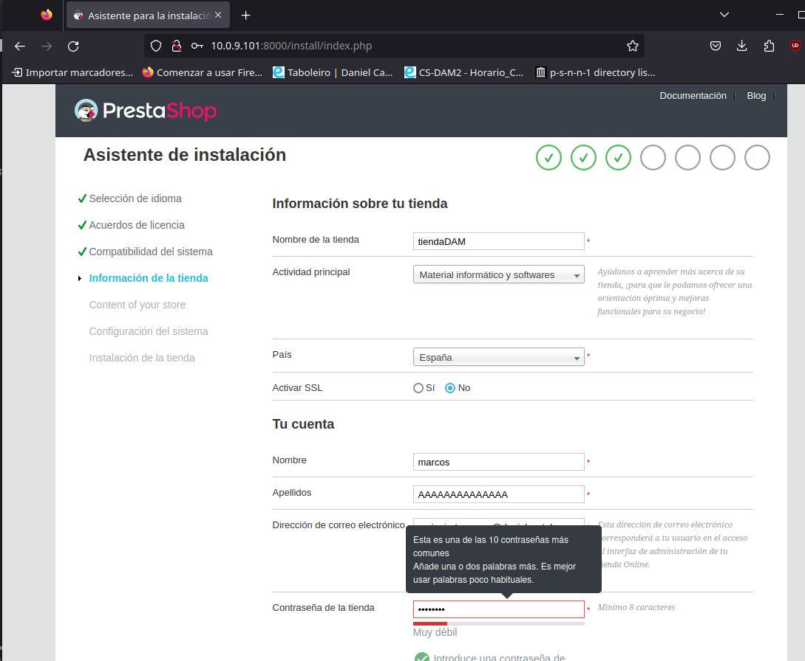

Configuramos la conexion a la base de datos y comporbamos que funcione

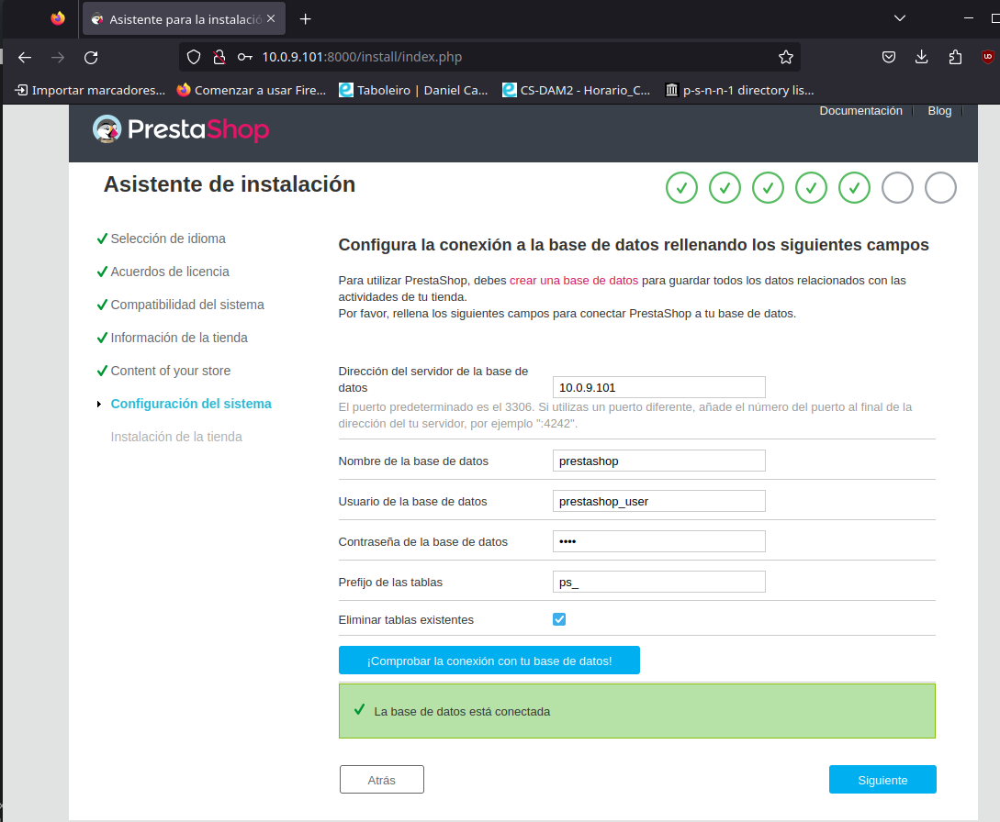

Esperamos a que la instalacion finalize

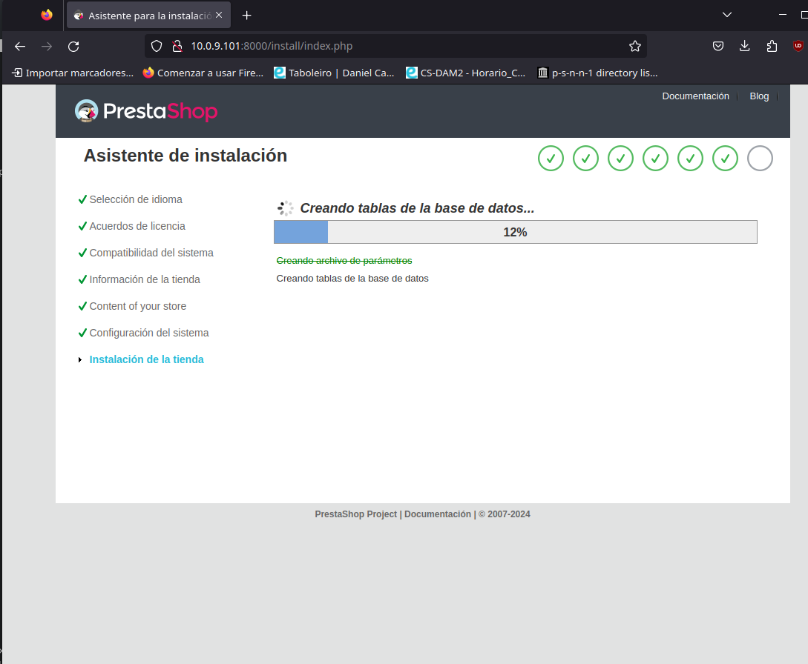

Ahora tenemos que eliminar la carpeta install y renombrar la carpeta admin

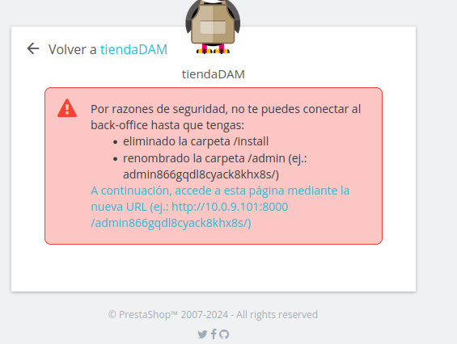

Entramos en el container
```sh
sudo docker compose exec ps bash
```

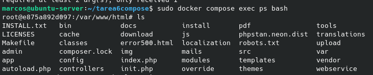

Eliminamos la carpeta install
```sh
rm -r install/
```

Renombramos la carpeta admin
```sh
mv admin/ admin449arzmyo29zbrujmi0/
```

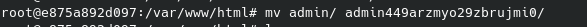

Ahora accedemos a la carpeta admin desde el navegador

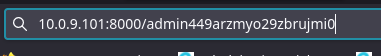

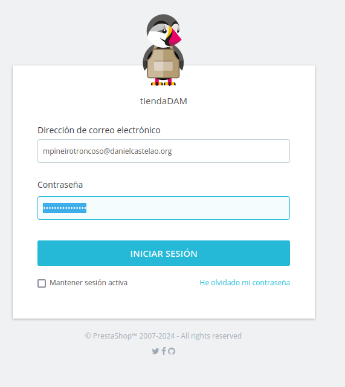

Ya podemos acceder al dashboard

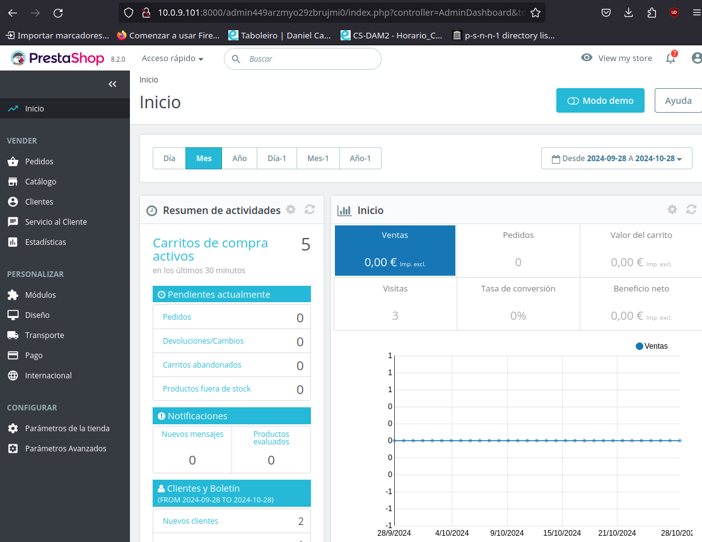
